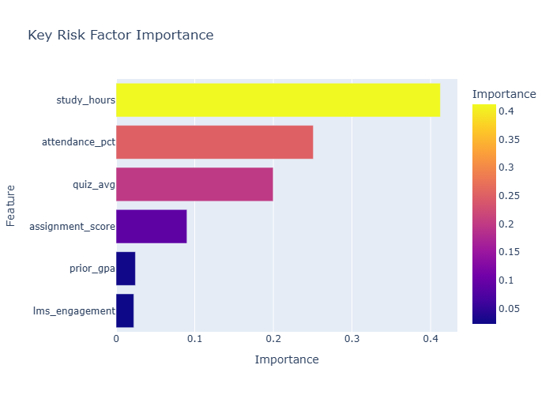
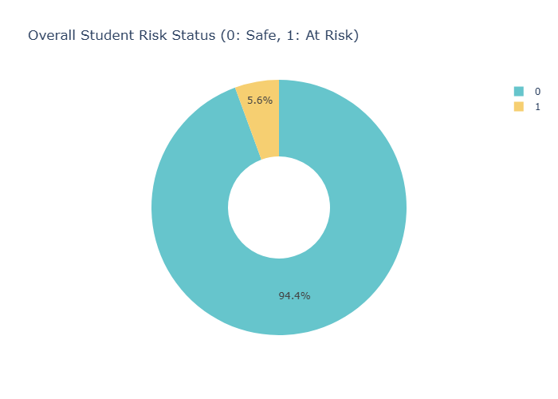

# 🎓 Student Performance Prediction System (Advanced ML Pipeline)

[](https://www.python.org/)
[](https://fastapi.tiangolo.com/)
[](https://xgboost.ai/)

This is an industry-oriented machine learning project designed to predict student performance levels using academic and behavioral signals. It features a modular Python architecture, an automated XGBoost pipeline, and a FastAPI inference service.

---

## 📊 Project Visuals

### 1️⃣ Key Risk Factors
Analysis of academic features impacting student performance predictions.


### 2️⃣ Risk Distribution
Breakdown of overall student risk status (Safe vs At-Risk).

---

## 🚀 Key Features
- **🎯 Advanced XGBoost Model**: Optimized for high-accuracy classification and early risk detection.
- **📊 Automated Visuals**: Real-time generation of feature importance and distribution plots.
- **🌐 FastAPI Integration**: Production-ready REST API for real-time inference.
- **🏗️ Modular Architecture**: Clean separation of data preprocessing, model development, and serving.
- **📱 Interactive Dashboard**: Auto-generated HTML dashboard for easy analysis.

## 🛠️ Tech Stack
| Category | Tools |
| :--- | :--- |
| **Machine Learning** | XGBoost, Scikit-learn, Pandas, Numpy |
| **Backend/API** | FastAPI, Uvicorn, Pydantic |
| **Visualization** | Plotly, Kaleido |
| **DevOps/Tools** | Git, Joblib, Virtualenv |

## 📂 Project Structure
```text
├── data/           # Simulated datasets (CSV)
├── src/            # Preprocessing & Model Development Logic
├── models/         # Saved XGBoost model and Scaler artifacts (.pkl)
├── images/         # Auto-generated visualization plots (.png)
├── outputs/        # Performance metrics and HTML dashboard
├── main.py         # Main Pipeline Orchestrator & API Entry
├── requirements.txt # Project dependencies
└── README.md       # Project documentation
⚙️ How to Run
1. Setup Environment
Bash
# Clone the repository
git clone [https://github.com/dalimkumar452-sudo/Student-Performance-Prediction.git](https://github.com/dalimkumar452-sudo/Student-Performance-Prediction.git)

# Navigate to directory
cd Student-Performance-Prediction

# Install dependencies
pip install -r requirements.txt
2. Execute Pipeline
Bash
python main.py
Note: This will train the model, generate images, save the dashboard, and start the API server.

3. Test API
Open your browser and go to:

Swagger UI: http://127.0.0.1:8000/docs

Home: http://127.0.0.1:8000/

👨‍💻 Developed by
Dalim Kumar Machine Learning Enthusiast & Developer GitHub Profile

Disclaimer: This project is part of an academic coursework for scientific research and predictive modeling